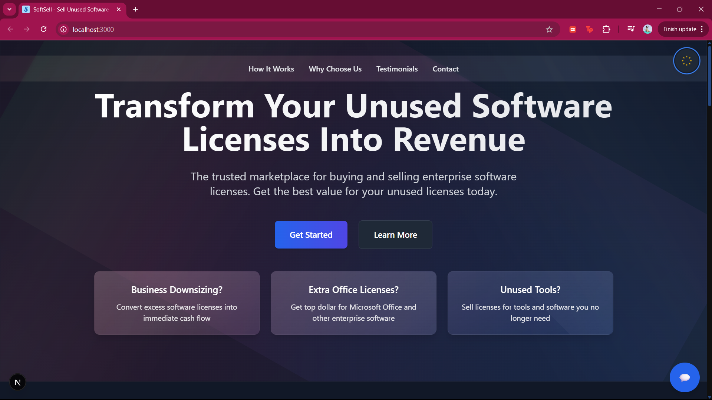

# SoftSell - Software License Marketplace

A modern, elegant marketplace for buying and selling enterprise software licenses. Built with Next.js and featuring stunning glass-morphism design with fluid animations.

<p align="center">
  
  
</p>
<p align="center">
  
  
</p>

## 🌟 Features

- **Modern Glass-morphism Design**
  - Stunning glass effect cards with dynamic reflections
  - Smooth gradient animations
  - Responsive layout for all devices
  - Dark/Light mode support

- **Interactive Elements**
  - Smooth scroll navigation
  - Animated section transitions
  - Interactive cards with hover effects
  - Fluid motion design

- **Core Sections**
  - Hero section with dynamic cards
  - How It Works process explanation
  - Why Choose Us benefits
  - Testimonials from satisfied customers
  - Contact form for inquiries

## 🚀 Tech Stack

- **Frontend Framework**: Next.js
- **Styling**: Tailwind CSS
- **Animations**: Framer Motion
- **Theme Switching**: next-themes
- **Type Safety**: TypeScript

## 📦 Dependencies

```json
{
  "dependencies": {
    "framer-motion": "^12.12.1",
    "next-themes": "^0.4.6"
  }
}
```

## 🛠️ Setup and Installation

1. **Clone the repository**
   ```bash
   git clone https://github.com/yourusername/softsell.git
   cd softsell
   ```

2. **Install dependencies**
   ```bash
   npm install
   # or
   yarn install
   ```

3. **Run the development server**
   ```bash
   npm run dev
   # or
   yarn dev
   ```

4. **Open in browser**
   Navigate to `http://localhost:3000`

## 🎨 Design Features

- **Glass Effect Cards**: Sophisticated glass-morphism design with dynamic reflections and smooth hover animations
- **Gradient Animations**: Subtle, flowing gradient backgrounds that create depth
- **Responsive Design**: Fully responsive layout that looks great on all devices
- **Dark/Light Modes**: Carefully crafted color schemes for both dark and light themes
- **Smooth Transitions**: Fluid animations between sections and states

## 🤝 Contributing

Contributions are welcome! Please feel free to submit a Pull Request.

## 📄 License

This project is licensed under the MIT License - see the [LICENSE](LICENSE) file for details.

## 🙏 Acknowledgments

- Design inspiration from modern glass-morphism trends
- Built with the amazing Next.js framework
- Animations powered by Framer Motion

---

Made with ❤️ by Ruchi Shaktawat
